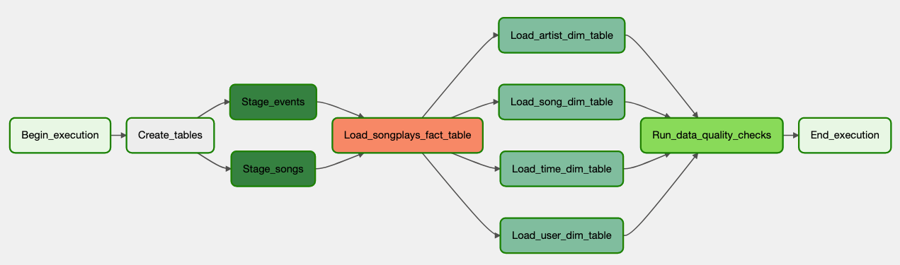

# Sparkify Data Pipelines

Welcome to Sparkify Data Pipelines!!

## About this Project

_"The objective of this project is to exercise ETL concepts as part of my [Data Engineer Nanodegree](https://www.udacity.com/course/data-engineer-nanodegree--nd027?gclid=CjwKCAjwrranBhAEEiwAzbhNtX2u0Cgqf42F_UgP68QhJ381lLzPJXH_MUBvquNKyhMGQZfr34Lh4hoCJKoQAvD_BwE&utm_campaign=19167921312_c_individuals&utm_keyword=udacity%20data%20engineering_e&utm_medium=ads_r&utm_source=gsem_brand&utm_term=143524475719)"._ 
The project consists of scripts used to build a ETL pipeline using airflow:

## Why?

This project is part of my personal portfolio, so, I'll be happy if you could provide me any feedback about the project, code, structure or anything that you can report that could make me a better developer!

Email-me: harrisonhenrisn@gmail.com

Connect with me at [LinkedIn](https://linkedin.com/in/harrison-henri-dos-santos-nascimento

## Built with

    

